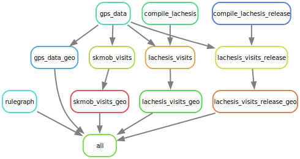

# lachesis_acceptance

Acceptance testing for the [lachesis](https://github.com/hamishgibbs/lachesis) crate.

Compares visits detected by lachesis to [`skmob.preprocessing.detection.stay_locations`](https://scikit-mobility.github.io/scikit-mobility//reference/preprocessing.html#skmob.preprocessing.detection.stay_locations).

### Usage

```
snakemake -j1 && snakemake --report output/report.html
```

Creates:

- An html report with runtimes for each visit detection method.
- GeoJSON files for each visit detection method.

### Workflow Diagram

